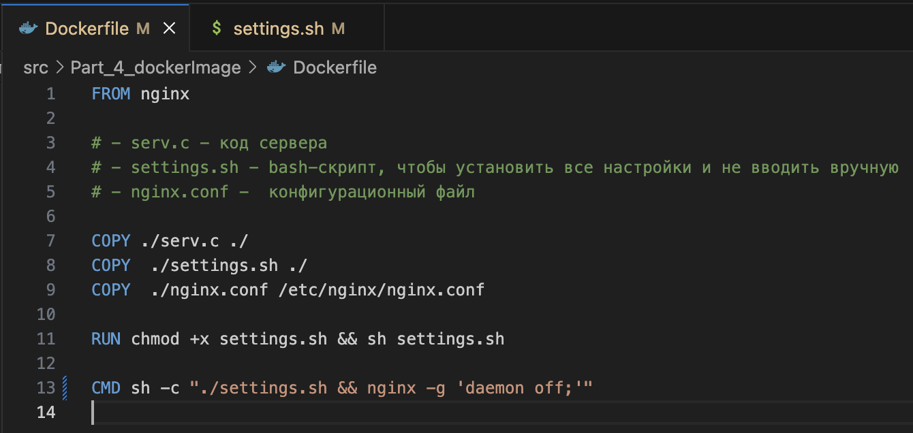
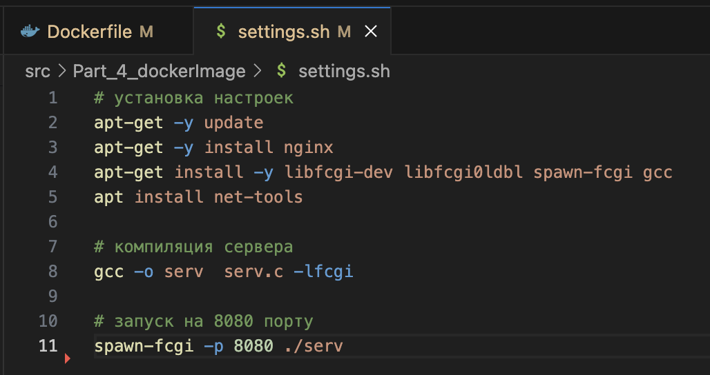
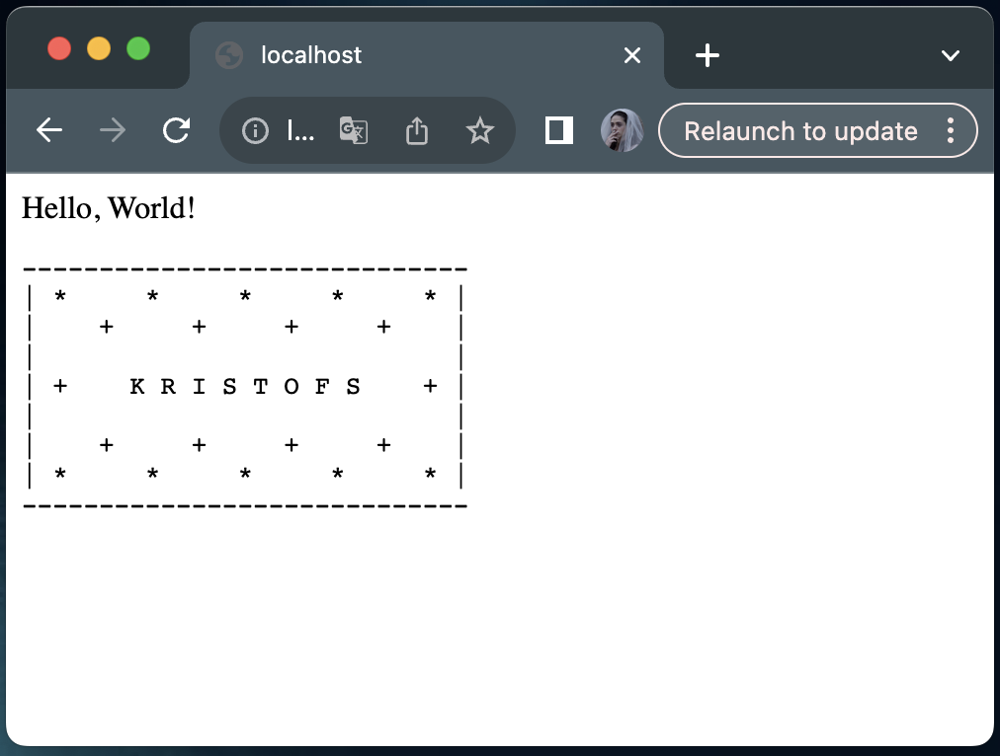
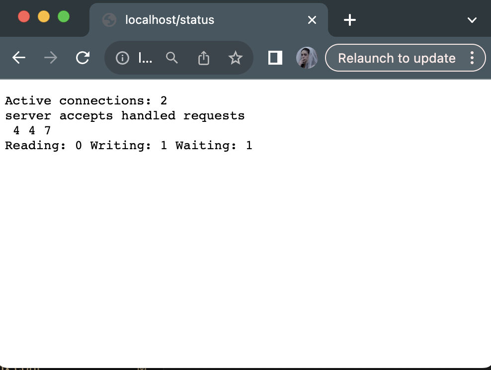
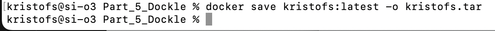

# Simple Docker

Введение в докер. Разработка простого докер-образа для собственного сервера.

## Contents

1. [Chapter I](#chapter-i)
2. [Chapter II](#chapter-ii) \
    2.1. [nginx](#nginx) \
    2.2. [Docker](#docker) \
    2.3. [Dockle](#dockle)
3. [Chapter III](#chapter-iii) \
    3.1. [Готовый докер](#part-1-готовый-докер) \
    3.2. [Операции с контейнером](#part-2-операции-с-контейнером) \
    3.3. [Мини веб-сервер](#part-3-мини-веб-сервер) \
    3.4. [Свой докер](#part-4-свой-докер) \
    3.5. [Dockle](#part-5-dockle) \
    3.6. [Базовый Docker Compose](#part-6-базовый-docker-compose)

## Chapter I

### **nginx**
**nginx** (произносится как «engine-x») — это обратный прокси-сервер с открытым исходным кодом для протоколов HTTP, HTTPS и т. д.
**nginx** также используется, как балансировщик нагрузки, веб-сервер и для кеширования HTTP.
У **nginx** есть один главный и несколько рабочих процессов.
Основная задача главного процесса — чтение и проверка конфигурации и управление рабочими процессами.
Рабочие процессы выполняют фактическую обработку запросов.
Как работают **nginx** и его модули, определяется в конфигурационном файле. По умолчанию конфигурационный файл называется *nginx.conf*.

### **Docker**
Контейнер – новый «исполняемый файл», включающий в себя все необходимые продукту зависимости. \
Главное преимущество контейнеризации – изоляция зависимостей и единая простая точка запуска ПО.

Основные понятия:
- Докер-образ – «упаковка» для приложения и зависимостей (в том числе системных).
- Контейнер – экземпляр образа, то есть «оживший» образ.

**Docker** — это платформа, которая предназначена для разработки, развёртывания и запуска приложений в контейнерах.
**Docker** – «де-факто» стандарт инструмента контейнеризации в индустрии, но он не является первым или последним среди технологий контейнеризации.

Предшественниками контейнеров **Docker** были виртуальные машины.
Докер-образ состоит из слоев. Каждый слой описывает какое-то изменение, которое должно быть выполнено с данными на запущенном контейнере.
Структура связей между слоями — иерархическая. Имеется базовый слой, на который «накладываются» остальные слои.
Для создания образа используется *Dockerfile*. Каждая инструкция в нем создает новый слой.

### **Dockle**
**Dockle** — это инструмент для проверки безопасности образов контейнеров, который можно использовать для поиска уязвимостей.

Основные функции и преимущества **Dockle**:
- поиск уязвимостей в образах;
- помощь в создании правильного Dockerfile;
- простота в использовании, нужно указать только имя образа;
- поддержка *CIS Benchmarks*.

### **Docker Compose**

Docker Compose — это инструментальное средство, которое предназначено для решения задач, связанных с развёртыванием проектов.
Docker Compose может пригодиться, если для обеспечения функционирования проекта используется несколько сервисов.

Docker Compose используется для одновременного управления несколькими контейнерами, входящими в состав приложения.
Этот инструмент предлагает те же возможности, что и Docker, но позволяет работать с более сложными распределенными приложениями, например микросервисными.


## Chapter III

В качестве результата работы по первым двум задачам должен быть предоставлен отчет.
В каждой части задания указано, что должно быть помещено в отчёт, после её выполнения.
Это могут быть ответы на вопросы, скриншоты и т. д.

В качестве результата работы по третьей задаче должны быть предоставлены исходные файлы для запуска веб-сервера.

В качестве результата работы по четвёртой и пятой задачам должны быть предоставлены докерфайлы.

В качестве результата работы по шестой задаче должен быть предоставлен файл *docker-compose.yml* и нужные для его запуска докерфайлы (если они не были предоставлены ранее).

- В репозиторий, в папку src, должен быть загружен отчёт с расширением .md;
- В отчёте должны быть выделены все части задания, как заголовки 2-го уровня;
- В рамках одной части задания всё, что помещается в отчёт, должно быть оформлено в виде списка;
- Каждый скриншот в отчёте должен быть кратко подписан (что показано на скриншоте);
- Все скриншоты обрезаны так, чтобы была видна только нужная часть экрана;
- На одном скриншоте допускается отображение сразу нескольких пунктов задания, но они все должны быть описаны в подписи к скриншоту;
- В репозиторий, в папку src/server, должны быть загружены исходные файлы для запуска веб-сервера из третьего задания;
- В репозиторий, в папку src, должны быть загружены итоговые докерфайлы для запуска образов из четвёртого и пятого заданий;
- В репозиторий, в папку src, должен быть загружен *docker-compose.yml* шестого задания;
- Необходимо быть готовым продемонстрировать решение вживую при необходимости.

## Part 1. Готовый докер

В качестве конечной цели своей небольшой практики ты сразу выбрал написание докер-образа для собственного веб-сервера, а потому в начале тебе нужно разобраться с уже готовым докер-образом для сервера.
Твой выбор пал на довольно простой **nginx**.


**== Задание ==**

##### Возьми официальный докер-образ с **nginx** и выкачай его при помощи `docker pull`.

- **Проверяю версию Docker и вообще установлен ли Docker через команду `docker --version`**


- **Выполняю команду `docker pull nginx`**

*Команда docker pull nginx используется для загрузки (скачивания) официального Docker-образа Nginx с Docker Hub (публичного реестра Docker-образов). Команда `docker pull` nginx скачивает этот образ на локальный компьютер. Docker обращается к Docker Hub и ищет образ с именем nginx c тегом `latest` последняя стабильная версия.*

*Nginx — это программа, которая помогает работать веб-сайтам. Она может:*
  - *Раздавать файлы (например, HTML, картинки, видео) людям, которые заходят на сайт.*
  - *Перенаправлять запросы на другие программы (например, если сайт написан на Python или PHP, Nginx передаст запрос этим программам).*
  - *Защищать сайт и ускорять его работу.*


##### Проверь наличие докер-образа через `docker images`.


##### Запусти докер-образ через `docker run -d [image_id|repository]`.

- **imade id** *нахожу на предыдущем скрине `97662d24417b`*

- запускаю через `docker run -d 97662d24417b`. На выходе получаю ID контейнера 


Docker проверяет, есть ли на компьютере образ с таким идентификатором. Если образ отсутствует, Docker попытается скачать его из Docker Hub. На основе этого образа Docker создаёт новый контейнер. Флаг **-d (detached)** означает, что контейнер будет работать в фоне и его вывод не виден в терминале. После запуска Docker выводит **ID контейнера** Этот ID можно использовать для управления контейнером (остановки, перезапуска, просмотра логов и т.д.)

С флагом -d контейнер запускается в фоновом режиме. Это значит, что он работает "в фоне", можно продолжать использовать терминал для других задач.

Без флага -d контейнер запускается в привязанном режиме (attached mode), и его вывод (логи) будет отображаться прямо в терминале, пока не закроется терминал.

##### Проверь, что образ запустился через `docker ps`.

`docker ps` — это одна из основных команд Docker, которая используется для просмотра списка запущенных контейнеров. 


##### Посмотри информацию о контейнере через `docker inspect [container_id|container_name]`.

##### По выводу команды определи и помести в отчёт размер контейнера, список замапленных портов и ip контейнера.

через grep вывожу информацию только про размер контейнера, замапленных портов и ip контейнера.


##### Останови докер контейнер через `docker stop [container_id|container_name]`.
##### Проверь, что контейнер остановился через `docker ps`.


##### Запусти докер с портами 80 и 443 в контейнере, замапленными на такие же порты на локальной машине, через команду *run*.


Маппинг портов (или проброс портов) — это процесс, который позволяет связывать порты на хосте с портами внутри контейнера или другого устройства. Это нужно, чтобы программы на хосте могли общаться с программами внутри контейнера или удалённого устройства.

Порт 80 обычно используется для обычного веб-трафика (HTTP).
Порт 443 — для защищённого веб-трафика (HTTPS).

Маппинг нужен для того, чтобы все запросы, проходящие через порт хоста, перенаправлялись в Docker-контейнер. Сопоставление портов делает процессы внутри контейнера доступными извне.

При запуске нового Docker-контейнера с помощью команды docker run можно сопоставить порты опцией --publish или -p:

##### Проверь, что в браузере по адресу *localhost:80* доступна стартовая страница **nginx**.

ввожу в хроме `localhost:80`


##### Перезапусти докер контейнер через `docker restart [container_id|container_name]`.
##### Проверь любым способом, что контейнер запустился.

- Перезапускаю докер контейнер
- Проверяю, что контейнер запустился

Способ 1


Способ 2


## Part 2. Операции с контейнером

Докер-образ и контейнер готовы. Теперь можно покопаться в конфигурации **nginx** и отобразить статус страницы.

**== Задание ==**

##### Прочитай конфигурационный файл *nginx.conf* внутри докер контейнера через команду *exec*.

Как работают nginx и его модули, определяется в конфигурационном файле. По умолчанию, конфигурационный файл называется nginx.conf и расположен в каталоге /usr/local/nginx/conf, /etc/nginx или /usr/local/etc/nginx.

nginx состоит из модулей, которые настраиваются директивами, указанными в конфигурационном файле. Директивы делятся на простые и блочные. Простая директива состоит из имени и параметров, разделённых пробелами, и оканчивается точкой с запятой (;). Блочная директива устроена так же, как и простая директива, но вместо точки с запятой после имени и параметров следует набор дополнительных инструкций, помещённых внутри фигурных скобок ({ }). Если у блочной директивы внутри фигурных скобок можно задавать другие директивы, то она называется контекстом (примеры: events, http, server и location).

Директивы, помещённые в конфигурационном файле вне любого контекста, считаются находящимися в контексте main. Директивы events и http располагаются в контексте main, server — в http, а location — в server.

Часть строки после символа # считается комментарием.

Через команду cat вывожу *nginx.conf*:


##### Создай на локальной машине файл *nginx.conf*.


##### Настрой в нем по пути */status* отдачу страницы статуса сервера **nginx**.

Часть инфы брала здесь: 

https://nginx.org/ru/docs/beginners_guide.html

https://linux-notes.org/vklyuchit-status-servera-nginx-apache/


В Nginx конфигурация организована в виде контекстов (блоков), которые определяют, где и как применяются директивы.

Контекст http { ... } обязателен для всех HTTP-серверов. Он определяет настройки, связанные с обработкой HTTP-запросов.

Без этого контекста Nginx не поймёт, что это конфигурация для HTTP-сервера, и выдаст ошибку.

- ` events { ... }`- Обязательная секция для работы Nginx. Она определяет, как Nginx будет обрабатывать соединения.

`**worker_connections 1024;**` — это параметр, который указывает максимальное количество одновременных подключений, которые может обрабатывать один рабочий процесс Nginx.

- `server { ... }` - Блок server определяет виртуальный сервер. Это означает, что Nginx будет обрабатывать запросы, которые приходят на определённый порт (в данном случае порт 80). Этот блок позволяет настроить, как Nginx должен обрабатывать запросы для конкретного домена, IP-адреса или порта.

- `location /status { ... }` - Блок location определяет, как Nginx должен обрабатывать запросы, которые соответствуют определённому пути (в данном случае /status). Этот блок позволяет настроить обработку запросов для конкретного URL-пути. Если перейти по адресу http://localhost:80/status, Nginx обработает запрос в рамках этого блока.

- `stub_status` - Директива включает модуль stub_status, который генерирует страницу статуса Nginx. При переходе по пути /status, Nginx отображает страницу с текущей статистикой сервера

- `allow all` - Директива allow разрешает доступ к указанному пути для всех IP-адресов. Директива разрешает доступ к странице статуса (/status) всем пользователям. Это может быть полезно для тестирования, но в реальных сценариях доступ обычно ограничивают определёнными IP-адресами для безопасности.


##### Скопируй созданный файл *nginx.conf* внутрь докер-образа через команду `docker cp`.
шаблон команды: 
```bash
docker cp <путь к файлу на хост машине> containerid:<путь к файлу в контейнере>
```
```bash
docker cp ./nginx.conf 72d101f5c65:/etc/nginx/nginx.conf
```


- `docker exec` —  позволяет выполнить команду внутри запущенного контейнера.
- `ls -l` — для вывода содержимого директории в подробном формате с правами доступа, владельцем, размером и датой изменения.
- `/etc/nginx/` — директория конфигурации веб-сервера Nginx.


##### Перезапусти **nginx** внутри докер-образа через команду *exec*.

```bash
docker exec 72d101fd5c65 nginx -s reload
```


- `docker exec` - Команда позволяет выполнить команду внутри запущенного контейнера
- `nginx -s reload` - Это команда, которая отправляет сигнал reload процессу Nginx.
- `-s` - *сигнал*

##### Проверь, что по адресу *localhost:80/status* отдается страничка со статусом сервера **nginx**.


6 - общее количество принятых подключений.

6 — общее количество успешно обработанных подключений.

19 — общее количество обработанных запросов.

Reading: 0 Writing: 1 Waiting: 0:

0 — подключений, читающих данные.

1 — подключений, отправляющих данные.

0 — бездействующих подключений.

##### Экспортируй контейнер в файл *container.tar* через команду *export*.

```bash
docker export <container_id_or_name> -o <output_file.tar>
```


##### Останови контейнер.


##### Удали образ через `docker rmi [image_id|repository]`, не удаляя перед этим контейнеры.
```bash
docker rmi -f nginx
```

- Docker-образ — это **шаблон** или **исходный код** для создания контейнеров.
- Образ содержит всё необходимое для запуска приложения: код, зависимости, библиотеки, конфигурации и даже операционную систему.
----------
- Docker-контейнер — это **запущенный экземпляр образа**.
- Контейнер — это изолированная среда, в которой работает приложение, описанное в образе.
----------
- **Образ** — это шаблон, который содержит всё необходимое для запуска приложения.
- **Контейнер** — это запущенный экземпляр образа, в котором работает приложение.


##### Удали остановленный контейнер.


##### Импортируй контейнер обратно через команду *import*.

```bash
docker import <путь_к_архиву> <имя_нового_образа>
```
Docker создаёт новый образ на основе файлов из архива container.tar.


##### Запусти импортированный контейнер.

```bash
docker run -d -p 80:80 -p 443:443 aa4466e2b6b8 nginx -g "daemon off;"
```


- `-p 80:80 -p 443:443` - `-p` (или `--publish`) используется для **проброса портов**. Он связывает порты на хосте с портами внутри контейнера. Можно оюращаться к сервисам внутри контейнера через `http://localhost:80` и `https://localhost:443`.

- `nginx -g "daemon off;"` - Запускает веб-сервер Nginx с параметром `-g "daemon off;"`.

  - `-g "daemon off;"` — параметр, который заставляет Nginx работать в **foreground mode** (режиме переднего плана). Это нужно, чтобы контейнер не завершал работу сразу после запуска.

- Создаёт и запускает контейнер из образа `aa44662b6b8`.
- Запускает в фоновом режиме (`-d`).
- Пробрасывает порты 80 и 443.
- Запускает Nginx в foreground mode.

##### Проверь, что по адресу *localhost:80/status* отдается страничка со статусом сервера **nginx**.


## Part 3. Мини веб-сервер

Теперь стоит немного оторваться от докера, чтобы подготовиться к последнему этапу. Время написать свой сервер.

**== Задание ==**

##### Напиши мини-сервер на **C** и **FastCgi**, который будет возвращать простейшую страничку с надписью `Hello World!`.
https://lectureswww.readthedocs.io/5.web.server/fcgi.html

- **`fcgi_stdio.h`** — библиотека для работы с FastCGI-протоколом.
- **`FCGI_Accept()`** — функция для принятия и обработки запросов от веб-сервера.

- FastCGI — это протокол, который позволяет Nginx взаимодействовать с сервером на C.
- Библиотека `fcgi_stdio.h` предоставляет функции для обработки запросов и отправки ответов через FastCGI.
- Функция `FCGI_Accept()` используется для принятия нового запроса от Nginx.

- Функция блокирует выполнение программы до тех пор, пока не поступит новый запрос от веб-сервера.
- Если запрос успешно принят, функция возвращает `0`.
- Если произошла ошибка или соединение закрыто, функция возвращает отрицательное значение.


1. Nginx принимает HTTP-запрос от клиента.
2. Nginx перенаправляет запрос на  сервер через сокет.
3. FastCGI-приложение обрабатывает запрос с помощью `FCGI_Accept()` и отправляет ответ обратно веб-серверу.
4. Nginx передает ответ клиенту.


##### Запусти написанный мини-сервер через *spawn-fcgi* на порту 8080.

1. Запускаю докер контейнер 

```bash
docker run -d -p 80:80 -p 81:81 -p 8080:8080 97662d24417b
```
Опция `-p` (или `--publish`) используется для проброса портов между хостом и контейнером. 
Формат: `-p <порт_на_хосте>:<порт_в_контейнере>`.

- Контейнеры изолированы от хоста. По умолчанию, порты внутри контейнера недоступны снаружи.
- Проброс портов позволяет "открыть" порты контейнера для доступа с хоста или из внешней сети.


2. Смотрю ID контейнера


3. Из-за того, что было несколько попыток сделать это задание правильно, для удобства написала небольшой скрипт который клонирует в контейнер файлы:
- сервер на C `serv.c`
- конфигурационный файл nginx.conf
- скрипт для установок настроек для контейнера `settings.sh`:


Запускаю этот скрипт:


4. В отдельном окне терминала выхожу в терминал контейнера

```bash
docker exec -it 17423f3bae95 /bin/bash
```


5. Из-за того, что было несколько попыток сделать это задание правильно, для удобства написала небольшой скрипт, чтобы установить необходимые настройки:


- Обновление списка доступных пакетов из репозиториев. Не устанавливает и не обновляет пакеты, подготавливает систему для этих операций

```bash
apt-get update
``` 

- Для функции **FCGI_Accept()** и gcc для компиляции и для запуска сервера через **spawn-fcgi**

```bash
apt-get install -y libfcgi-dev libfcgildb1 spawn-fcgi 
```

- Во время выполнения использовала команду netstat -tuln чтобы смотреть какие порты слушаются

```bash
gcc apt install net-tools  
```

- Проверка установленных версий gcc и spawn-fcgi

```bash
gcc --version spawn-fcgi -v 
```

- Компилирую файл **serv.c** (важно! с флагом -lfcgi, иначе компилятор не поймет, что за метод *FCGI_Accept*)

```bash
gcc -o serv serv.c -Ifcgi
```

6. Запускаю сервер: 

```bash
spawn-fcgi -p 8080 ./serv
```


##### Напиши свой *nginx.conf*, который будет проксировать все запросы с 81 порта на *127.0.0.1:8080*.

Так как пыталась сделать задание несколько раз, заранее прописала конфигурационный файл nginx.conf и еще при запуске скрипта скопировала его в контейнер 


Файл уже скопирован, но настройки этого файла не были применены, поэтому перезагружаю **nginx**

```bash
nginx -s reload
```


Hello World! должно выводиться на порту 81

1. Nginx слушает порт 81 и принимает НТТР-запросы.
2. Nginx перенаправляет эти запросы на FastCGI сервер (приложение на С), который должен слушать другой порт.
3. FastCGI сервер обрабатывает запрос и возвращает ответ (Hello World!), который Nginx передает клиенту.

Порт 81 используется для входящих НТТР-запросов, а порт 8080 - для внутреннего взаимодействия между Nginx и FastCGI сервером.

##### Проверь, что в браузере по *localhost:81* отдается написанная тобой страничка.


##### Положи файл *nginx.conf* по пути *./nginx/nginx.conf* (это понадобится позже).

В самом начале при запуске скрипта settings.sh я копировала *nginx.conf* по пути *./nginx/nginx.conf*

## Part 4. Свой докер

Теперь всё готово. Можно приступать к написанию докер-образа для созданного сервера.

**== Задание ==**

*При написании докер-образа избегай множественных вызовов команд RUN*

https://habr.com/ru/companies/ruvds/articles/439980/

https://stackoverflow.com/questions/77980040/modify-nginx-base-image-with-a-dockerfile


#### Напиши свой докер-образ, который:
##### 1) собирает исходники мини сервера на FastCgi из [Части 3](#part-3-мини-веб-сервер);
##### 2) запускает его на 8080 порту;
##### 3) копирует внутрь образа написанный *./nginx/nginx.conf*;
##### 4) запускает **nginx**.
_**nginx** можно установить внутрь докера самостоятельно, а можно воспользоваться готовым образом с **nginx**'ом, как базовым._


1. Создала Dockerfile: 
  - задала родительский образ
  - cкопировала все необходимые файлы
  - дала права для скрипта settings.sh, запустила скрипт
  - CMD запускается при создании контейнера
    - Если скрипт завершается успешно (код 0), выполняется следующая команда.
    - Команда `nginx -g 'daemon off;'` запускает Nginx и удерживает его в foreground режиме, чтобы Docker считал его основным процессом контейнера. По умолчанию Nginx запускается в фоновом режиме. Docker контейнер работает до тех пор, пока работает его основной процесс.
    - Если Nginx запускается в фоновом режиме, Docker завершает контейнер, так как основной процесс (команда `nginx`) завершается.
    - `nginx -g 'daemon off;'` - Запускает Nginx в foreground режиме, чтобы Docker считал его основным процессом.
    - флаг `-c`:  флаг, который указывает оболочке выполнить команду, переданную в виде строки.



2.  Создала скрипт settings.sh: 
    - установила все настройки:
      - nginx
      - gcc
      - spawn-fcgi
      - libfcgi-dev
      - net-tools (при возможных ошибках позволяет посмотреть, какие порты слушаются)
    - скомпилировала serv.c с флагом -lfcgi
    - запустила на  8080 порту



##### Собери написанный докер-образ через `docker build` при этом указав имя и тег.

**Чтобы у меня получилось собрать образ, пришлось зарегестрироваться на docker hub** 
**`https://hub.docker.com/`. После регистрации зашла через команду в терминале `docker login`, где ввела свой логин и пароль с docker hub**

```bash
docker build -t kristofs . 
```


##### Проверь через `docker images`, что все собралось корректно.


##### Запусти собранный докер-образ с маппингом 81 порта на 80 на локальной машине и маппингом папки *./nginx* внутрь контейнера по адресу, где лежат конфигурационные файлы **nginx**'а (см. [Часть 2](#part-2-операции-с-контейнером)).

```bash
docker run -d -p 80:81 -v ./nginx.conf:/etc/nginx/nginx.conf kristofs
```
Флаг -v позволяет монтировать файлы или директории с хостовой машины в контейнер. Сейчас используется для передачи конфигурации nginx.conf в контейнер. 

Запускаю контейнер и смотрю итог через  `docker ps`


##### Проверь, что по localhost:80 доступна страничка написанного мини сервера.



##### Допиши в *./nginx/nginx.conf* проксирование странички */status*, по которой надо отдавать статус сервера **nginx**.


##### Перезапусти докер-образ.


*Если всё сделано верно, то, после сохранения файла и перезапуска контейнера, конфигурационный файл внутри докер-образа должен обновиться самостоятельно без лишних действий*.
##### Проверь, что теперь по *localhost:80/status* отдается страничка со статусом **nginx**


## Part 5. **Dockle**

**== Задание ==**

Перед выполнением задания скачала Dockle через homebrew

```Bash
brew install goodwithtech/r/dockle
```


##### Просканируй образ из предыдущего задания через `dockle [image_id|repository]`.

Просто просканировать образ у меня не получилось, пришлось сделать сначала архив через команду: 

Шаблон: `save <IMAGE's name>:<tag (latest)> -o <name of tar>.tar`

```Bash
docker save kristofs:latest -o kristofs.tar
```
 

После этого просканировала архив: 

```Bash
dockle --input kristofs.tar 
```

Ошибки:

 

##### Исправь образ так, чтобы при проверке через **dockle** не было ошибок и предупреждений.

https://github.com/goodwithtech/dockle/blob/master/CHECKPOINT.md#cis-di-0010

Ошибки:

**CIS-DI-0001:** `Create a user for the container` : добавила группу nginx-user

Указывает, что Docker-образ не создает отдельного пользователя для запуска процессов внутри контейнера. Вместо этого процессы запускаются от имени root, это небезопасно. Запуск процессов от имени root внутри контейнера может привести к получению root прав для злоумышленника

- добавила группу nginx-user
- добавила пользователя nginx-user
- дала файлам связанным с nginx нового владельца nginx-user

**CIS-DI-0005:** `Enable Content trust for Docker` : при каждой новой сессии терминала после создания образа

Ошибка указывает, что в Docker-окружении не включена Docker Content Trust (DCT). Docker Content Trust — это механизм, который обеспечивает проверку целостности и подлинности образов, загружаемых из Docker Registry, с помощью цифровых подписей.

```Bash
export DOCKER_CONTENT_TRUST=1
```
**CIS-DI-0006:** `Add HEALTHCHECK instruction to the container image` :

Связана с рекомендацией по безопасности контейнеров, описанной в CIS Docker Benchmark. Указывает, что в Docker-образе отсутствует инструкция HEALTHCHECK, которая позволяет Docker периодически проверять работоспособность контейнера.

Инструкция HEALTHCHECK в Dockerfile позволяет определить команду, которая будет выполняться внутри контейнера для проверки его состояния. Если контейнер не проходит проверку, Docker может автоматически перезапустить его или уведомить об этом.

```Bash
HEALTHCHECK --interval=5m --timeout=3s
```

--interval=5m: Проверка здоровья выполняется каждые 5 минут.
--timeout=3s: Если команда проверки (curl) не завершится в течение 3 секунд, она считается неудачной.
```Bash
CMD curl -f http://localhost:80 || exit 1
```

curl -f http://localhost:80: команда, которая выполняется внутри контейнера для проверки его состояния.

curl -f  : если сервер возвращает HTTP-код ошибки, curl завершится с ненулевым кодом возврата.

|| exit 1: Если команда curl завершится с ошибкой, то выполнится exit 1, контейнер будет помечен как нездоровый (unhealthy).

Если curl успешно выполняется (сервер возвращает HTTP-код 200), контейнер считается здоровым (healthy).

**CIS-DI-0010:** `Do not store credential in environment variables/files` :

связана с рекомендацией по безопасности контейнеров, описанной в **CIS Docker Benchmark**. Она указывает на то, что в Docker-образе не следует хранить учетные данные в **переменных окружения** или **файлах** внутри контейнера. 

Команда `export DOCKLE_ACCEPT_KEYS=NGINX_GPGKEYS,NGINX_GPGKEY_PATH` позволяет игнорировать определенные проверки, связанные с ключами GPG для NGINX, которые могут быть ложными срабатываниями.
   - Устанавливает переменную окружения `DOCKLE_ACCEPT_KEYS`, которая указывает Dockle игнорировать проверки, связанные с `NGINX_GPGKEYS` и `NGINX_GPGKEY_PATH`.

```Bash
export DOCKLE_ACCEPT_KEYS=NGINX_GPGKEYS,NGINX_GPGKEY_PATH
```
```Bash
dockle --input kristofs.tar
```

## Part 6. Базовый **Docker Compose**

**== Задание ==**

Чтобы была возможность запустить Docker Compose, его нужно сначала скачать \
Cкачиваю через команду: 

```Bash
brew install docker-compose
```
 
 


##### Напиши файл *docker-compose.yml*, с помощью которого:

##### 1) Подними докер-контейнер из [Части 5](#part-5-инструмент-dockle) _(он должен работать в локальной сети, т. е. не нужно использовать инструкцию **EXPOSE** и мапить порты на локальную машину)_.

Когда говорится, что контейнер должен работать в локальной сети, это означает, что контейнер будет доступен только для других контейнеров в той же Docker-сети, но не будет доступен снаружи (с хостовой машины или из внешних сетей).

Инструкция EXPOSE используется в Dockerfile для указания, какие порты контейнер будет "слушать" (открывать для взаимодействия). Она не пробрасывает порты на хост-машину, а только сообщает Docker, что контейнер будет использовать указанные порты.


##### 2) Подними докер-контейнер с **nginx**, который будет проксировать все запросы с 8080 порта на 81 порт первого контейнера.
##### Замапь 8080 порт второго контейнера на 80 порт локальной машины.

##### Останови все запущенные контейнеры.
##### Собери и запусти проект с помощью команд `docker-compose build` и `docker-compose up`.
##### Проверь, что в браузере по *localhost:80* отдается написанная тобой страничка, как и ранее.
